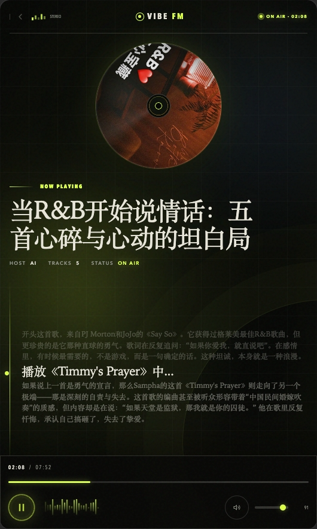
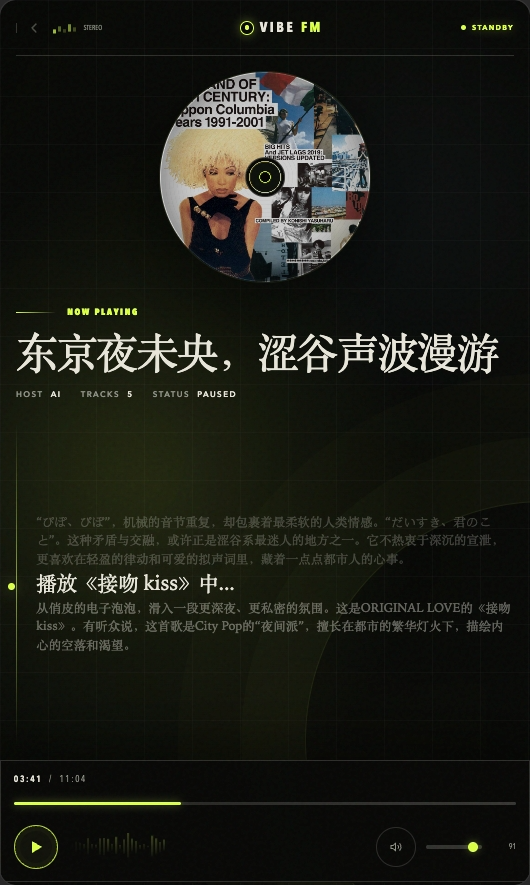

<div align="center">

[English](README_EN.md) | 中文

# vibeFM — 一个不存在的音乐电台

**AI 电台节目编排引擎：从网易云歌单出发，完成选曲、主播文稿、语音合成与音频编排，把播放列表变成完整电台节目。**

[](https://nodejs.org)
[](https://www.typescriptlang.org)
[](https://nextjs.org)
[](LICENSE)

<br/>
<br/>

<table>
  <tr>
    <td align="center" width="33%"></td>
    <td align="center" width="33%"></td>
    <td align="center" width="33%"></td>
  </tr>
</table>

</div>

---

### 目录

- [核心理念](#核心理念)
- [功能特性](#功能特性)
- [RadioScript DSL](#radioscript-dsl)
- [技术栈](#技术栈)
- [快速开始](#快速开始)
- [使用方法](#使用方法)
- [自定义 Prompt](#自定义-prompt)
- [项目结构](#项目结构)
- [免责声明](#免责声明)

### 核心理念

vibeFM 不只是让 AI 决定“下一首播什么”，而是先生成一份可编辑、可解析、可执行的 RadioScript，再由程序完成 TTS、音乐、铺底、淡入淡出与最终混音。

```text
歌单 + 节目主题
      ↓
AI 生成 RadioScript
      ↓
解析为时间线事件
      ↓
TTS / 音乐 / BGM / 转场
      ↓
FFmpeg 渲染完整节目
```

> 把歌单变成节目，而不只是播放列表。

### 功能特性

- **智能歌单导入** — 支持通过网易云音乐歌单 URL 或关键词搜索导入
- **AI 节目策划** — 根据节目主题与歌单内容完成选曲、结构设计和情绪编排
- **RadioScript 生成** — 输出可人工编辑、程序解析和稳定复现的电台节目脚本
- **主播语音合成** — 根据 `voice_design_prompt` 生成统一风格的主持人口播
- **音频演出编排** — 支持主音乐、铺底音乐、音量、起始时间、时长和淡入淡出
- **完整节目渲染** — 使用 FFmpeg 合成带字幕的完整电台节目
- **Web 与 CLI 双入口** — 既可通过网页操作，也可集成到自动化工作流

### RadioScript DSL

RadioScript 是一种面向 AI 生成和音频渲染的“Markdown + 类 HTML 标签”格式。它将内容生成与音频执行解耦，使节目可以被阅读、修改、解析和重新渲染。

```markdown
---
title: 深夜仍未熄灭的房间
voice_design_prompt: 温柔、克制、略带疲惫感的深夜电台主播
---

# Opening

<host>晚上好，这里是 vibeFM。今晚，我们从一张歌单出发，听几首适合独处的歌。</host>

<audio source="/audio/123456.wav" role="main" volume="100%" fade_in="2s">
  <audio source="/audio/123456.wav" role="bed" volume="18%" start="45s" duration="20s" fade_in="2s" fade_out="2s" />
</audio>

# Ending

<host>感谢收听，愿今晚的声音替你保留一点没有说出口的情绪。</host>
```

### 技术栈

| 层级 | 技术 |
|------|------|
| 前端 | Next.js 15 + Tailwind CSS |
| 后端 | Next.js App Router API Routes |
| AI | OpenAI 兼容 API（支持自定义 Base URL） |
| 音频编排 | RadioScript DSL + FFmpeg 8.1.1+ |
| 语言 | TypeScript |

### 快速开始

#### 环境要求

- Node.js >= 20.9.0
- FFmpeg 8.1.1+（需在 PATH 中）

#### 安装与配置

```bash
# 安装依赖
npm install

# 复制配置文件
cp .env.example .env
```

填入小米大模型配置（在 [MiMo 平台](https://platform.xiaomimimo.com/console/api-keys) 注册获取 API Key）：

```env
MIMO_API_KEY=your-api-key
MIMO_BASE_URL=https://token-plan-cn.xiaomimimo.com/v1
MIMO_MODEL=mimo-v2.5-pro
MIMO_TTS_MODEL=mimo-v2.5-tts-voicedesign
```

#### 获取网易云音乐 Cookie

> **重要**：运行以下命令自动从浏览器提取网易云音乐 Cookie，这是导入歌单和下载歌曲的前提。

```bash
npm run cli -- cookie
```

#### 检测环境

```bash
npm run cli -- test
```

<details>
<summary>成功输出示例</summary>

```json
{
  "success": true,
  "data": {
    "cookie": { "account": { "valid": true, "isVip": true } },
    "ai": { "model": "mimo-v2.5-pro", "response": "ok" }
  }
}
```

</details>

### 使用方法

#### Web 界面

```bash
npm run dev
```

访问 http://localhost:3000 使用 Web 界面。

#### CLI 命令

```bash
# 创建节目空间
npm run cli -- create <名称> [描述]

# 通过 URL 导入歌单
npm run cli -- create <名称> --playlist-url 'https://music.163.com/playlist?id=xxx'

# 通过关键词搜索导入歌单
npm run cli -- create <名称> --playlist-query '关键词'

# 生成完整节目（运行失败可重复执行）
npm run cli -- generate all <名称> --count 5

# 查看节目列表 / 详情
npm run cli -- show list
npm run cli -- show <名称>
```

### 自定义 Prompt

节目策划与 RadioScript 生成阶段均可通过修改 Prompt 模板控制节目结构、主持风格和音频编排策略：

```
prompts/
├── plan.system.md    # 节目策划 - 系统指令
├── plan.user.md      # 节目策划 - 用户模板
├── script.system.md  # 节目文稿 - 系统指令
└── script.user.md    # 节目文稿 - 用户模板
```

> 修改 Prompt 后无需重新编译，下次运行命令即生效。

### 项目结构

```
vibeFM/
├── src/
│   ├── app/          # Next.js API 路由
│   ├── cli/          # CLI 命令实现
│   └── core/         # 核心业务逻辑
├── public/           # 前端页面
├── prompts/          # AI Prompt 模板
├── docs/             # 项目文档
├── assets/           # 公共素材（BGM、音效）
└── .vibefm/          # 节目工作空间
```

### 免责声明

本项目仅供学习与技术研究使用，部分功能依赖非官方接口。使用者应自行确认音乐来源、账号权限、平台条款及相关版权要求，请勿将本项目用于未经授权的内容分发或商业用途。

### 许可证

[GPL](LICENSE)